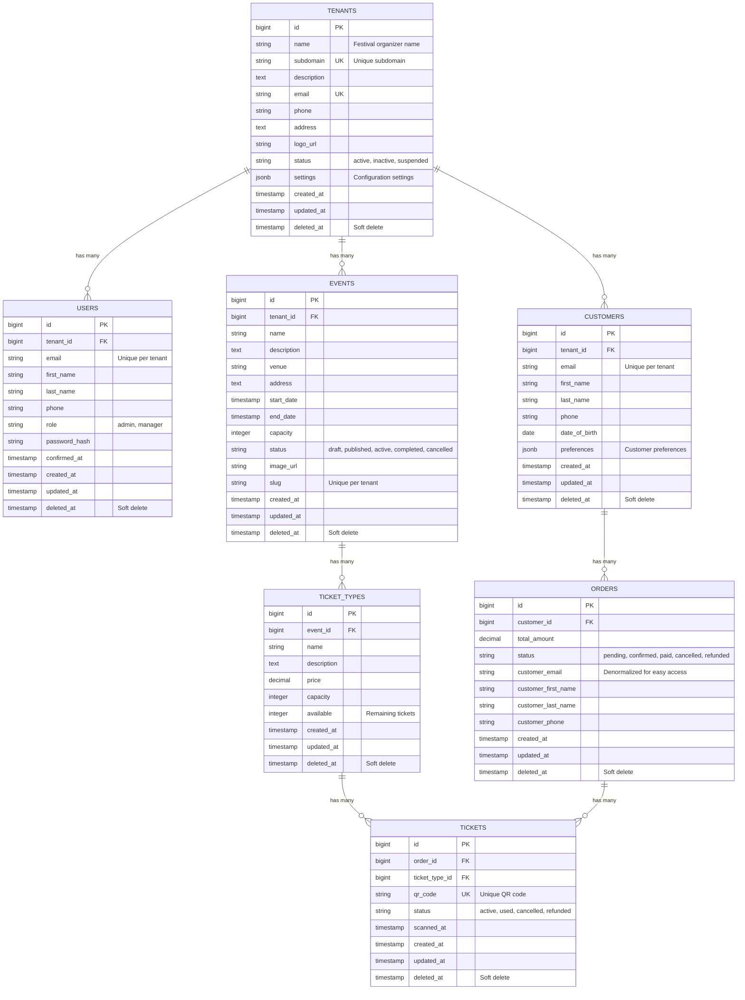

# 🗄️ Ticketify Database Schema

## Overview
Ticketify uses a **multi-tenant architecture** where each festival organizer (tenant) has complete data isolation. All entities are scoped to tenants to ensure secure separation of data.

## 🏗️ Entity Relationship Diagram



## 📋 Table Definitions

### `tenants`
**Purpose**: Festival organizers/companies that use the platform
- **Primary Key**: `id`
- **Unique Constraints**: `subdomain`, `email`
- **Indexes**: `subdomain`

| Column | Type | Constraints | Description |
|--------|------|-------------|-------------|
| id | bigint | PRIMARY KEY | Auto-incrementing ID |
| name | varchar(255) | NOT NULL | Festival organizer name |
| subdomain | varchar(255) | NOT NULL, UNIQUE | Subdomain for tenant (e.g., 'summer-fest') |
| description | text | NOT NULL | Description of the organization |
| email | varchar(255) | NOT NULL, UNIQUE | Contact email |
| phone | varchar(255) | | Contact phone |
| address | text | | Physical address |
| logo_url | varchar(255) | | URL to organization logo |
| status | varchar(255) | NOT NULL, DEFAULT 'active' | active, inactive, suspended |
| settings | jsonb | DEFAULT '{}' | Tenant configuration settings |
| created_at | timestamp | NOT NULL | Record creation time |
| updated_at | timestamp | NOT NULL | Record last update time |
| deleted_at | timestamp | | Soft delete timestamp (NULL if active) |

### `users`
**Purpose**: Admin and manager accounts for each tenant
- **Primary Key**: `id`
- **Foreign Keys**: `tenant_id` → `tenants(id)`
- **Unique Constraints**: `email` (per tenant via application logic)
- **Indexes**: `tenant_id`

| Column | Type | Constraints | Description |
|--------|------|-------------|-------------|
| id | bigint | PRIMARY KEY | Auto-incrementing ID |
| tenant_id | bigint | NOT NULL, REFERENCES tenants(id) | Owning tenant |
| email | varchar(255) | NOT NULL | User email |
| first_name | varchar(255) | NOT NULL | First name |
| last_name | varchar(255) | NOT NULL | Last name |
| phone | varchar(255) | | Phone number |
| role | varchar(255) | NOT NULL, DEFAULT 'admin' | admin, manager |
| password_hash | varchar(255) | | Bcrypt hashed password |
| confirmed_at | timestamp | | Email confirmation timestamp |
| created_at | timestamp | NOT NULL | Record creation time |
| updated_at | timestamp | NOT NULL | Record last update time |
| deleted_at | timestamp | | Soft delete timestamp (NULL if active) |

### `customers`
**Purpose**: People who buy tickets from tenants
- **Primary Key**: `id`
- **Foreign Keys**: `tenant_id` → `tenants(id)`
- **Unique Constraints**: `(email, tenant_id)`
- **Indexes**: `tenant_id`, `(email, tenant_id)`

| Column | Type | Constraints | Description |
|--------|------|-------------|-------------|
| id | bigint | PRIMARY KEY | Auto-incrementing ID |
| tenant_id | bigint | NOT NULL, REFERENCES tenants(id) | Owning tenant |
| email | varchar(255) | NOT NULL | Customer email |
| first_name | varchar(255) | NOT NULL | First name |
| last_name | varchar(255) | NOT NULL | Last name |
| phone | varchar(255) | | Phone number |
| date_of_birth | date | | Date of birth (for age validation) |
| preferences | jsonb | DEFAULT '{}' | Customer preferences |
| created_at | timestamp | NOT NULL | Record creation time |
| updated_at | timestamp | NOT NULL | Record last update time |
| deleted_at | timestamp | | Soft delete timestamp (NULL if active) |

### `events`
**Purpose**: Festivals and concerts organized by tenants
- **Primary Key**: `id`
- **Foreign Keys**: `tenant_id` → `tenants(id)`
- **Unique Constraints**: `(slug, tenant_id)`
- **Indexes**: `tenant_id`, `(slug, tenant_id)`

| Column | Type | Constraints | Description |
|--------|------|-------------|-------------|
| id | bigint | PRIMARY KEY | Auto-incrementing ID |
| tenant_id | bigint | NOT NULL, REFERENCES tenants(id) | Owning tenant |
| name | varchar(255) | NOT NULL | Event name |
| description | text | NOT NULL | Event description |
| venue | varchar(255) | NOT NULL | Venue name |
| address | text | NOT NULL | Venue address |
| start_date | timestamp | NOT NULL | Event start time |
| end_date | timestamp | NOT NULL | Event end time |
| capacity | integer | NOT NULL | Total event capacity |
| status | varchar(255) | NOT NULL, DEFAULT 'draft' | draft, published, active, completed, cancelled |
| image_url | varchar(255) | | Event image URL |
| slug | varchar(255) | | URL-friendly event identifier |
| created_at | timestamp | NOT NULL | Record creation time |
| updated_at | timestamp | NOT NULL | Record last update time |
| deleted_at | timestamp | | Soft delete timestamp (NULL if active) |

### `ticket_types`
**Purpose**: Different categories of tickets for each event
- **Primary Key**: `id`
- **Foreign Keys**: `event_id` → `events(id)`
- **Indexes**: `event_id`

| Column | Type | Constraints | Description |
|--------|------|-------------|-------------|
| id | bigint | PRIMARY KEY | Auto-incrementing ID |
| event_id | bigint | NOT NULL, REFERENCES events(id) | Parent event |
| name | varchar(255) | NOT NULL | Ticket type name (e.g., "VIP", "General") |
| description | text | NOT NULL | Ticket type description |
| price | decimal(10,2) | NOT NULL | Ticket price |
| capacity | integer | NOT NULL | Total tickets of this type |
| available | integer | NOT NULL | Remaining available tickets |
| created_at | timestamp | NOT NULL | Record creation time |
| updated_at | timestamp | NOT NULL | Record last update time |
| deleted_at | timestamp | | Soft delete timestamp (NULL if active) |

### `orders`
**Purpose**: Purchase transactions made by customers
- **Primary Key**: `id`
- **Foreign Keys**: `customer_id` → `customers(id)`
- **Indexes**: `customer_id`

| Column | Type | Constraints | Description |
|--------|------|-------------|-------------|
| id | bigint | PRIMARY KEY | Auto-incrementing ID |
| customer_id | bigint | REFERENCES customers(id) | Purchasing customer |
| total_amount | decimal(10,2) | NOT NULL | Total order amount |
| status | varchar(255) | NOT NULL, DEFAULT 'pending' | pending, confirmed, paid, cancelled, refunded |
| customer_email | varchar(255) | NOT NULL | Denormalized customer email |
| customer_first_name | varchar(255) | NOT NULL | Denormalized customer first name |
| customer_last_name | varchar(255) | NOT NULL | Denormalized customer last name |
| customer_phone | varchar(255) | | Denormalized customer phone |
| created_at | timestamp | NOT NULL | Record creation time |
| updated_at | timestamp | NOT NULL | Record last update time |
| deleted_at | timestamp | | Soft delete timestamp (NULL if active) |

### `tickets`
**Purpose**: Individual tickets with QR codes
- **Primary Key**: `id`
- **Foreign Keys**: `order_id` → `orders(id)`, `ticket_type_id` → `ticket_types(id)`
- **Unique Constraints**: `qr_code`
- **Indexes**: `order_id`, `ticket_type_id`, `qr_code`

| Column | Type | Constraints | Description |
|--------|------|-------------|-------------|
| id | bigint | PRIMARY KEY | Auto-incrementing ID |
| order_id | bigint | NOT NULL, REFERENCES orders(id) | Parent order |
| ticket_type_id | bigint | NOT NULL, REFERENCES ticket_types(id) | Ticket type |
| qr_code | varchar(255) | NOT NULL, UNIQUE | Unique QR code for scanning |
| status | varchar(255) | NOT NULL, DEFAULT 'active' | active, used, cancelled, refunded |
| scanned_at | timestamp | | When ticket was scanned/used |
| created_at | timestamp | NOT NULL | Record creation time |
| updated_at | timestamp | NOT NULL | Record last update time |
| deleted_at | timestamp | | Soft delete timestamp (NULL if active) |

## 🔐 Multi-Tenant Data Isolation

### Tenant Scoping Strategy
- **Direct tenant_id**: `users`, `customers`, `events` have direct `tenant_id` foreign keys
- **Inherited scoping**: `ticket_types` inherit tenant through `event_id`
- **Double inheritance**: `orders` and `tickets` inherit tenant through customer/event relationships

### Query Patterns
All queries must be scoped to the current tenant:

```elixir
# ✅ Correct - tenant scoped
def list_events(%Tenant{} = tenant) do
  Event
  |> where([e], e.tenant_id == ^tenant.id)
  |> Repo.all()
end

# ❌ Incorrect - not tenant scoped
def list_events do
  Repo.all(Event)
end
```

## 🔄 Data Flow Examples

### Customer Places Order
1. Customer exists or is created in `customers` table (scoped to tenant)
2. Order created in `orders` table (linked to customer)
3. Individual tickets created in `tickets` table (linked to order and ticket_type)
4. Ticket availability decremented in `ticket_types` table

### Ticket Scanning
1. QR code scanned at venue
2. Ticket found by `qr_code` in `tickets` table
3. Ticket status updated to 'used'
4. `scanned_at` timestamp recorded

## 📊 Key Business Rules

### Tenant Isolation
- All data operations must be scoped to the current tenant
- Customers can only see orders/tickets within their tenant
- Users can only manage data within their tenant

### Inventory Management
- `ticket_types.available` tracks remaining tickets
- Decremented when orders are confirmed
- Incremented when orders are cancelled

### Order States
- `pending` → `confirmed` → `paid`
- Can be cancelled from `pending` or `confirmed` states
- `refunded` state for post-payment cancellations

### Ticket States
- `active` → `used` (via QR scanning)
- Can be `cancelled` if order is cancelled
- `refunded` for refunded orders

## 🔍 Important Indexes

### Performance Indexes
- `tenants(subdomain)` - Fast tenant lookup by subdomain
- `users(tenant_id)` - Fast user queries per tenant
- `customers(tenant_id)` - Fast customer queries per tenant
- `events(tenant_id)` - Fast event queries per tenant
- `tickets(qr_code)` - Fast ticket scanning

### Uniqueness Indexes
- `tenants(subdomain)` - Unique subdomains
- `tenants(email)` - Unique tenant emails
- `customers(email, tenant_id)` - Unique customer email per tenant
- `events(slug, tenant_id)` - Unique event slug per tenant
- `tickets(qr_code)` - Globally unique QR codes

## 🚨 Data Integrity Constraints

### Foreign Key Constraints
- All relationships enforced with `REFERENCES` constraints
- `ON DELETE RESTRICT` prevents accidental data loss
- Cascading deletes handled at application level

### Check Constraints
- Price values must be >= 0
- Capacity values must be > 0
- Available tickets cannot exceed capacity
- End dates must be after start dates

---

**Last Updated**: December 2024  
**Schema Version**: 1.0 (Multi-tenant architecture)
